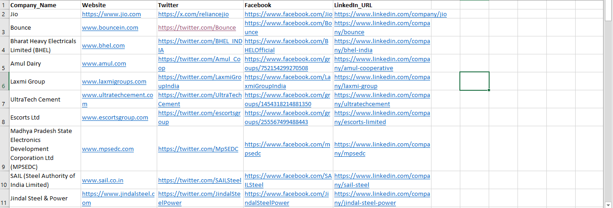
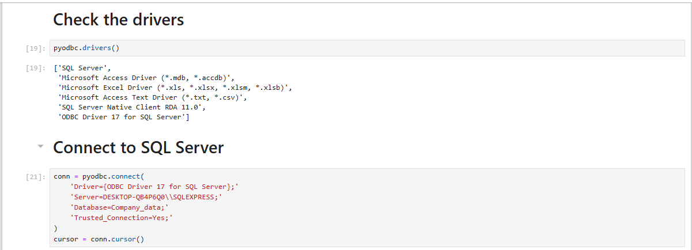
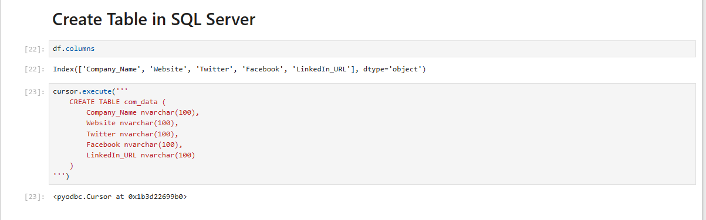
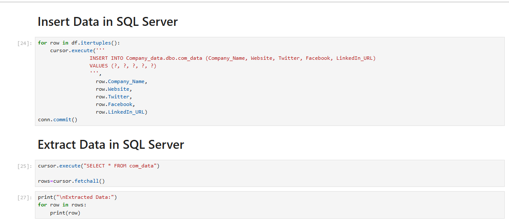
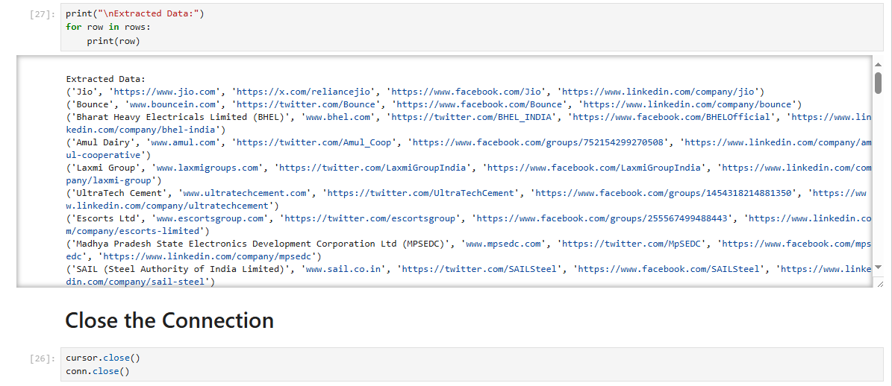

# Loading-Excel-Data-into-SQL-Server-Using-Python
Excited to Share My Latest Work: Loading Excel Data into SQL Server Using Python

I hope you're all doing great! I'm excited to share my latest project: Loading Excel Data into SQL Server Using Python.
In this project, I collected data from various sources and used Jupyter Notebook along with the Pandas and PyODBC libraries to efficiently load and manage data. Here’s an overview of the process:

1️⃣ Import the necessary libraries (Pandas & PyODBC)

2️⃣ Load the Excel file and display the first five rows

3️⃣ Check available SQL Server drivers

4️⃣ Establish a connection to SQL Server using the driver, server name, database name, and trusted connection

5️⃣ Create a table in SQL Server

6️⃣ Insert data from the Excel file into the SQL Server table

7️⃣ Extract and display the inserted data

8️⃣ Verify the data in SQL Server

9️⃣ Close the connection

This method ensures seamless data transfer from Excel to SQL Server, making it easier to manage large datasets efficiently. 
Would love to hear your thoughts and feedback! Let’s connect and discuss more. 

Here you can watch full video: https://lnkd.in/gFi9XtRU

# Input

# Python-Code

# Output

